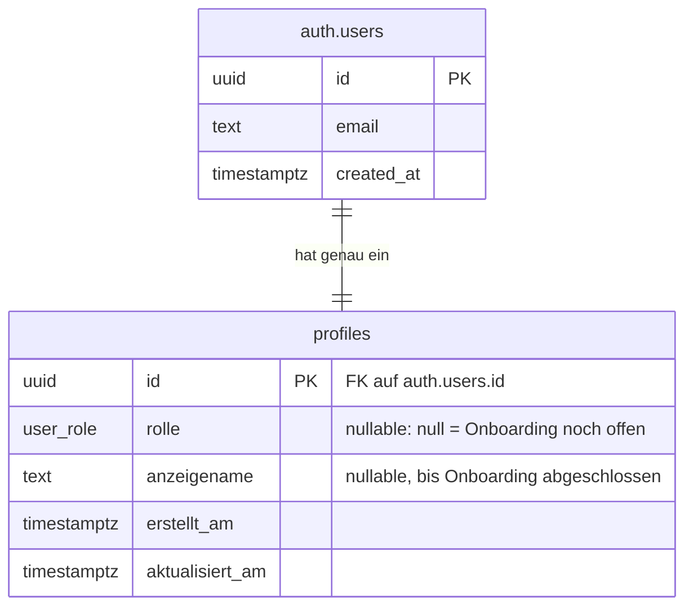

# Datenmodell

Stand: Phase B (Auth & Rollen). Enthält alle bisher existierenden Tabellen. Rollenspezifische
Profildaten (Freelancer-Skills, Portfolio, Firmendaten) kommen erst in Phase C dazu und sind
hier bewusst noch nicht enthalten.

## ER-Diagramm



`auth.users` gehört zu Supabase Auth selbst (wir legen diese Tabelle nicht an und verändern ihr
Schema nicht) und ist hier nur als Bezugspunkt eingezeichnet.

## Tabellen im Detail

### `profiles`

Ein Profil pro registrierter Person. Die Tabelle ist absichtlich schlank gehalten — sie enthält
nur das, was für Rollenwahl und Anzeige unabhängig von der konkreten Rolle gebraucht wird.
Rollenspezifische Daten (z. B. Stundensatz für Freelancer, Branche für Unternehmen) werden in
Phase C in eigenen, per Fremdschlüssel verknüpften Tabellen ergänzt, nicht direkt in `profiles`,
damit diese Tabelle nicht mit vielen rollenabhängig leeren Spalten aufgebläht wird.

Jede Zeile entsteht automatisch: Ein Datenbank-Trigger (`handle_new_user`) legt beim Anlegen
eines neuen `auth.users`-Eintrags sofort eine passende `profiles`-Zeile an, mit `id` gesetzt und
`rolle`/`anzeigename` noch leer. Dadurch kann es nie einen Nutzer-Account ohne zugehöriges Profil
geben — die Applikation muss diesen Fall nicht gesondert behandeln.

| Spalte            | Typ           | Erklärung                                                                                                                                                                                                                                                                                                                                       |
| ----------------- | ------------- | ----------------------------------------------------------------------------------------------------------------------------------------------------------------------------------------------------------------------------------------------------------------------------------------------------------------------------------------------- |
| `id`              | `uuid`        | Primärschlüssel, gleichzeitig Fremdschlüssel auf `auth.users.id` (1:1-Beziehung, mit `on delete cascade`: Profil verschwindet automatisch, wenn der Account gelöscht wird).                                                                                                                                                                     |
| `rolle`           | `user_role`   | Enum mit den Werten `unternehmen`, `freelancer`, `admin`. Ist so lange `null`, bis das Onboarding abgeschlossen ist — dieser Nullwert ist das Signal, mit dem Proxy und Dashboards erkennen, dass eine Person noch ins Onboarding muss. `admin` ist als Wert vorgesehen, aber in Phase B nirgends im UI wählbar oder mit Funktionen hinterlegt. |
| `anzeigename`     | `text`        | Der Name, unter dem eine Person in der Plattform erscheint. Wird zusammen mit `rolle` im einzigen Onboarding-Schritt gesetzt.                                                                                                                                                                                                                   |
| `erstellt_am`     | `timestamptz` | Zeitpunkt der Trigger-Anlage.                                                                                                                                                                                                                                                                                                                   |
| `aktualisiert_am` | `timestamptz` | Wird von einem zweiten Trigger (`handle_profiles_updated_at`) bei jedem `UPDATE` automatisch neu gesetzt — die Applikation muss das nicht selbst pflegen und kann es folglich auch nicht vergessen.                                                                                                                                             |

## Row Level Security

RLS ist auf `profiles` aktiv; ohne passende Policy verweigert Postgres jeden Zugriff, auch für
eingeloggte Nutzer:innen (siehe [ADR 004](adr/004-rollen-berechtigung-rls.md) zur Begründung,
warum die Durchsetzung in der Datenbank liegt und nicht nur in der Applikation).

- **Lesen:** Jede authentifizierte Person darf jedes Profil lesen, nicht nur das eigene. Das ist
  bewusst so gewählt, weil die spätere Freelancer-Suche (Phase D) alle Profile durchsuchbar machen
  muss — Profile sind also innerhalb der eingeloggten Nutzerschaft öffentlich, aber für anonyme
  Besucher:innen komplett unsichtbar (keine einzige Policy für die Rolle `anon`).
- **Schreiben:** Nur das eigene Profil darf aktualisiert werden (`auth.uid() = id`, sowohl beim
  Lesen der zu ändernden Zeile als auch bei der Prüfung des neuen Werts).
- **Anlegen/Löschen:** Es gibt bewusst keine INSERT- oder DELETE-Policy für normale Nutzer:innen.
  Zeilen entstehen ausschliesslich über den security-definer-Trigger `handle_new_user` und
  verschwinden automatisch über die `on delete cascade`-Fremdschlüsselbeziehung, wenn der
  zugehörige `auth.users`-Eintrag gelöscht wird. Ohne diese Einschränkung könnten Nutzer:innen
  sonst beliebige Profile mit fremder `id` anlegen.

Zusätzlich zu den Policies braucht die Rolle `authenticated` explizite Tabellen-`GRANT`s
(`select`, `update`) — RLS-Policies regeln nur, welche _Zeilen_ sichtbar sind, nicht ob die Rolle
die Operation grundsätzlich versuchen darf. Das haben wir beim ersten lokalen RLS-Test selbst
gemerkt (`permission denied for table profiles`, obwohl die Policies korrekt waren) und in der
Migration entsprechend ergänzt.

## RLS lokal verifizieren

Mit laufendem Docker:

```bash
npx supabase start
```

Danach zwei Nutzer:innen per `@supabase/supabase-js` gegen `http://127.0.0.1:54321` registrieren
und prüfen: Nutzer A darf das Profil von Nutzer B lesen, aber nicht schreiben; anonyme Anfragen
sehen gar nichts. Dieser Test lief während der Entwicklung erfolgreich gegen die lokale Instanz
(siehe Commit-Historie von Phase B).

### Manueller Fallback ohne Docker

Falls die lokale Supabase-Instanz nicht startbar ist (kein Docker verfügbar), lässt sich dieselbe
Prüfung direkt per SQL gegen eine beliebige Postgres-Verbindung mit den Zugangsdaten zweier
Test-Nutzer:innen nachvollziehen. Ersetze `<ID_A>` und `<ID_B>` mit den tatsächlichen
`auth.users.id`-Werten zweier Testkonten:

```sql
-- Als Nutzer A einloggen (simuliert durch Setzen der Postgres-Session-Variable, die RLS liest):
set local role authenticated;
set local request.jwt.claims = '{"sub": "<ID_A>", "role": "authenticated"}';

-- Darf lesen (erwartet: 1 Zeile):
select id, rolle from public.profiles where id = '<ID_B>';

-- Darf NICHT schreiben (erwartet: 0 geänderte Zeilen):
update public.profiles set anzeigename = 'gehackt' where id = '<ID_B>';

-- Darf das eigene Profil schreiben (erwartet: 1 geänderte Zeile):
update public.profiles set anzeigename = 'Test A' where id = '<ID_A>';

reset role;
```

Ohne gesetzte `request.jwt.claims` (also als anonyme Verbindung) sollte die erste Abfrage
0 Zeilen liefern.
